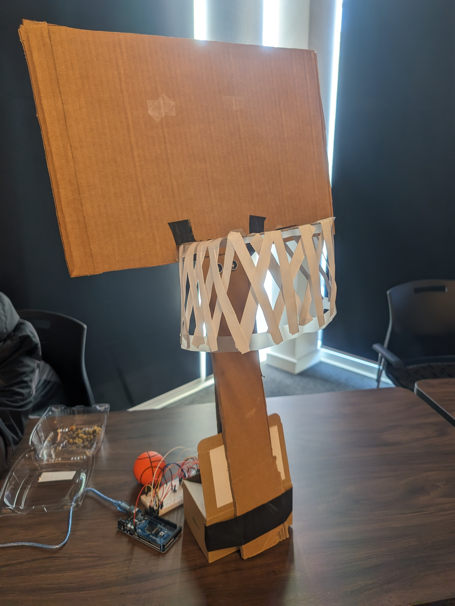
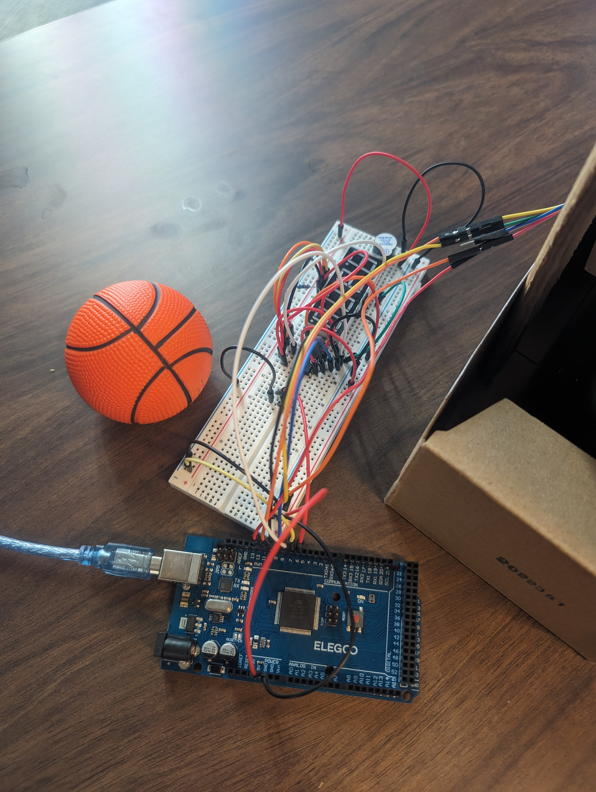
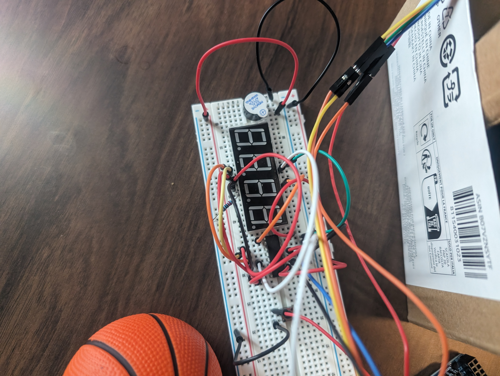
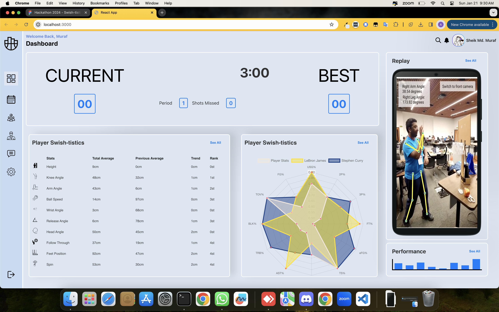

  <h2>🏀 Scaled-Down Prototype: Realizing Swish-tistics Vision 🏀</h2>

  

    The image above features a mini basketball hoop used to demonstrate the Swish-tistics concept. While our current prototype is miniaturized for hackathon constraints, the future vision is to implement Swish-tistics on full-size basketball hoops.

  
  

    The images above show the hardware setup behind designing the scoring system for the basketball. An ultrasonic sensor is placed behind the net which is then connected to Arduino, that already has a 7-segment display and buzzer connected to it. When the player scores, the 7-segment display updates the score and the buzzer makes a noise.   

  <h2>🌟📊 The Piece de Resistance: Swish-tistics Website 🌟</h2> 

  

  
### Website's Purpose

On the Swish-tistics website, players use an app on their phone that uses Tensorflow and their phone camera to outline their knees and arms, helping them assess the correctness of their form. The parameters are then sent to the website in real-time, allowing players to see and improve.

### Real-time Feedback

Players can see live updates of their form on the website as they make adjustments, facilitating instant feedback for improvement.

### Scoring System

A scoring system motivates players to beat their highest scores, encouraging deeper engagement with Swish-tistics and continuous improvement.

### Statistics and Comparison

Players can add their statistics to a radial graph, enabling comparisons with world-class players or their own statistics from a month ago, providing valuable insights into their progress.

This integrated approach combines real-time feedback, a scoring system, and statistical analysis, making Swish-tistics a comprehensive tool for basketball players of any skill level to enhance their skills.

